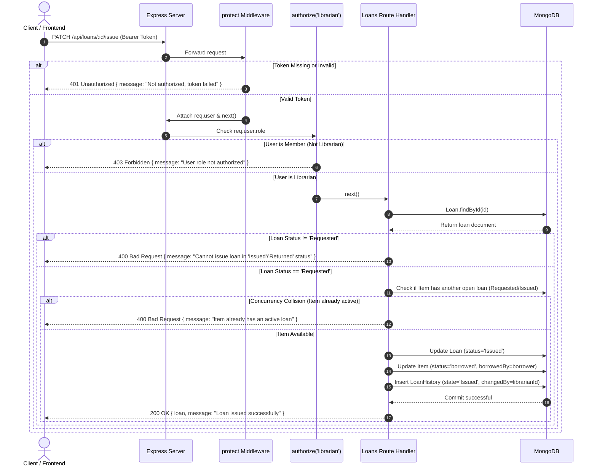

# System Architecture & Technical Specifications

This document provides the definitive architecture overview, directory layout, authentication flow, Mermaid request lifecycle diagrams, Mermaid state transition models, and complete endpoint authorization matrix for the Asset Lending System.

---

## 1. Monorepo Folder Structure

```
smart-lending-system/
│
├── package.json                   # Monorepo root scripts (install:all, backend, frontend, build, seed, test)
├── render.yaml                    # Render Web Service blueprint manifest
├── SUBMISSION.md                  # Final submission report & deployment runbook
├── .gitignore
│
├── docs/                          # Technical documentation
│   ├── ai-prompts.md              # Paced AI prompt history across all 6 sessions
│   ├── architecture.md            # System architecture, diagrams & endpoint matrix (this document)
│   ├── decisions.md               # 21 architectural decisions & trade-off logs
│   ├── plan.md                    # 6-day build schedule & time estimates vs. actuals
│   └── schema.md                  # Production MongoDB/Mongoose schemas & relationships
│
├── backend/                       # Express + Node.js REST API
│   ├── .env.example               # Backend environment variables template
│   ├── package.json               # Backend dependencies (express, mongoose, bcryptjs, jsonwebtoken, cors)
│   ├── server.js                  # App bootstrap, CORS, route mounting, index sync & error handlers
│   ├── seed.js                    # Multi-role demo seed script (3 librarians, 5 members, 17 items, 26 loans)
│   ├── start-db.js                # Persistent local in-memory MongoDB runner (MongoMemoryServer)
│   ├── test_lifecycle.js          # In-memory test suite for loan state machine & Day 4 query features
│   ├── test_day5.js               # In-memory test suite for bulk actions & operations dashboard stats
│   ├── test_audit.js              # 19-point role enforcement & security audit test suite
│   ├── middleware/
│   │   └── auth.js                # JWT verification (`protect`) & RBAC role guards (`authorize`)
│   ├── models/
│   │   ├── User.js                # User accounts & bcrypt password hashes (roles: member, librarian)
│   │   ├── Item.js                # Catalogue items, physical statuses & librarian custodians
│   │   ├── Loan.js                # Loan lifecycle, virtual `isOverdue` & partial unique index
│   │   └── LoanHistory.js         # Immutable append-only audit event log
│   └── routes/
│       ├── auth.js                # Register, login, current user & librarian/user listings
│       ├── items.js               # Asset CRUD, CSV bulk import & custodian assignment
│       ├── loans.js               # Loan state transitions, bulk return, export, search & timeline
│       └── dashboard.js           # Headline stats, status/custodian breakdowns & 8-week return trends
│
└── frontend/                      # React + Vite Client SPA
    ├── .env.example               # Frontend environment variables template (VITE_API_URL)
    ├── .gitignore
    ├── index.html                 # HTML5 single-page application root
    ├── package.json               # Frontend dependencies (react, react-dom, chart.js, vite)
    ├── vercel.json                # Vercel SPA routing rewrite rules
    ├── vite.config.js             # Vite compiler & React plugin config
    └── src/
        ├── App.jsx                # Unified SPA controller: Auth, Catalogue, Loans, Alerts, Dashboard, Modals
        └── index.css              # Clean, pure Vanilla CSS stylesheet (no external CSS frameworks)
```

---

## 2. Authentication & Authorization Architecture

### Password Security & Hashing
- Passwords are never stored in plaintext.
- Hashing is executed via `bcryptjs` using a cost factor of **10 salt rounds** (`bcrypt.genSalt(10)`).
- On registration, password hashes are computed before writing the document to MongoDB.
- On login, `bcrypt.compare(candidatePassword, user.password)` validates credentials.

### JWT Token Lifecycle & Payload
- Tokens are signed using `jsonwebtoken` (`jwt.sign()`) with a **1-day expiration** (`{ expiresIn: '1d' }`).
- The JWT secret is loaded from `process.env.JWT_SECRET` (with fallback for local tests).
- The JWT payload contains minimal sanitized identity attributes:
  ```json
  {
    "id": "6a992aa0f69538522f1ffe70",
    "username": "librarian",
    "role": "librarian"
  }
  ```
- Clients store the token in `localStorage` and transmit it on every authenticated request via the `Authorization: Bearer <token>` HTTP header.

### Middleware Chain Enforcement
1. **`protect` Middleware** (`backend/middleware/auth.js`):
   - Extracts the Bearer token from the `Authorization` header.
   - Verifies signature and expiration using `jwt.verify(token, JWT_SECRET)`.
   - Populates `req.user` with `{ id: decoded.id, username: decoded.username, role: decoded.role }`.
   - Returns **HTTP 401 Unauthorized** if the token is missing, expired, or invalid.
2. **`authorize(...roles)` Middleware** (`backend/middleware/auth.js`):
   - Evaluates `req.user.role` against allowed roles.
   - Returns **HTTP 403 Forbidden** if the user lacks the required role.

---

## 3. Request Lifecycle Diagram (Librarian Issuing a Loan)

The sequence diagram below traces an issue request (`PATCH /api/loans/:id/issue`), illustrating both the happy path and key failure rejection branches.



---

## 4. Loan Lifecycle State Machine

The state diagram below illustrates all valid lifecycle states, transitions, guard constraints, and dynamic overdue evaluations.

```mermaid
stateDiagram-v2
    [*] --> Requested: Member requests item (or Librarian initiates)
    
    state "Requested" as Requested {
        note right of Requested: Item in catalogue remains 'available'.<br/>Atomic partial unique index blocks second open request.
    }

    Requested --> Issued: Librarian issues loan (PATCH /loans/:id/issue)
    
    state "Issued" as Issued {
        note right of Issued: Item marked 'borrowed' with borrowedBy pointer.<br/>isOverdue dynamically computed: (dueDate < now).<br/>Overdue is NEVER stored as a hardcoded status string!
    }

    Issued --> Returned: Librarian records return (PATCH /loans/:id/return or Bulk Return)
    Issued --> Lost: Librarian marks lost (PATCH /loans/:id/lost)

    state "Returned" as Returned {
        note right of Returned: Item catalogue reset to 'available'.<br/>Loan history timeline updated.<br/>Counts towards 8-week return chart.
    }

    state "Lost" as Lost {
        note right of Lost: Item catalogue marked 'lost'.<br/>Audit trail captures damage/loss report.
    }

    Returned --> [*]
    Lost --> [*]
```

---

## 5. Complete Endpoint Authorization Matrix

Every route in the application is strictly governed by server-side role and tenant authorization rules:

| Resource Group | HTTP Method | Endpoint Path | Access Level | Server-Side Authorization & Business Rules |
|---|---|---|---|---|
| **Auth** | `POST` | `/api/auth/register` | Public | Client role parameter is ignored; unconditionally forces `role: 'member'`. |
| **Auth** | `POST` | `/api/auth/login` | Public | Validates bcrypt hash; returns signed JWT token with user object. |
| **Auth** | `GET` | `/api/auth/me` | Authenticated | Returns current authenticated user record (`id`, `username`, `role`). |
| **Auth** | `GET` | `/api/auth/librarians` | Librarian only | Rejects members with **403 Forbidden**. Returns list of librarians for custodian assignment. |
| **Auth** | `GET` | `/api/auth/users` | Librarian only | Rejects members with **403 Forbidden**. Returns all registered users for admin triage. |
| **Items** | `GET` | `/api/items` | Authenticated | Returns full item catalogue with populated custodians and borrower fields. |
| **Items** | `POST` | `/api/items` | Librarian only | Rejects members with **403 Forbidden**. Validates name & category; initializes status to `'available'`. |
| **Items** | `POST` | `/api/items/bulk-import` | Librarian only | Rejects members with **403 Forbidden**. Parses RFC-compliant CSV; returns per-row success/rejection reports. |
| **Items** | `GET` | `/api/items/custodian` | Librarian only | Rejects members with **403 Forbidden**. Returns catalogue items where `custodians` contains `req.user.id`. |
| **Items** | `POST` | `/api/items/:id/custodians` | Librarian only | Rejects members with **403 Forbidden**. Adds specified librarian ID to item's `custodians` array (`$addToSet`). |
| **Items** | `DELETE` | `/api/items/:id/custodians/:userId` | Librarian only | Rejects members with **403 Forbidden**. Removes specified librarian ID from item's `custodians` array (`$pull`). |
| **Loans** | `GET` | `/api/loans` | Authenticated | Server-side search/filter/sort/pagination. **Strict Tenant Scoping**: Members are hardcoded to `borrower = req.user.id`; client borrower query params are discarded for members. |
| **Loans** | `GET` | `/api/loans/:id` | Authenticated | **Multi-tenant privacy**: Members can only access their own loans. Accessing another member's loan returns **403 Forbidden**. |
| **Loans** | `GET` | `/api/loans/:id/timeline` | Authenticated | **Multi-tenant privacy**: Returns chronological `LoanHistory` audit events. Access by unauthorized member returns **403 Forbidden**. |
| **Loans** | `POST` | `/api/loans` | Authenticated | Members are forced to `borrower = req.user.id` and `status = 'Requested'`. Librarians can direct-issue (`status = 'Issued'`). Concurrency guard checks for existing open loans. |
| **Loans** | `PATCH` | `/api/loans/:id/issue` | Librarian only | Rejects members with **403 Forbidden**. Validates loan is in `Requested` status, transitions to `Issued`, updates item to `borrowed`, logs history. |
| **Loans** | `PATCH` | `/api/loans/:id/return` | Librarian only | Rejects members with **403 Forbidden**. Validates loan is in `Issued` status, transitions to `Returned`, resets item to `available`, logs history. |
| **Loans** | `PATCH` | `/api/loans/:id/lost` | Librarian only | Rejects members with **403 Forbidden**. Validates loan is in `Issued` status, transitions to `Lost`, marks item as `lost`, logs incident report note. |
| **Loans** | `POST` | `/api/loans/bulk-return` | Librarian only | Rejects members with **403 Forbidden**. Processes array of loan IDs, validates each is `Issued`, returns per-loan status report. |
| **Loans** | `GET` | `/api/loans/export` | Librarian only | Rejects members with **403 Forbidden**. Streams CSV file containing all active `Issued` loans with borrower & overdue metadata. |
| **Loans** | `GET` | `/api/loans/overdue` | Librarian only | Rejects members with **403 Forbidden**. Returns active `Issued` loans past due date where `alertDismissed: false`. |
| **Loans** | `PATCH` | `/api/loans/:id/dismiss-alert` | Librarian only | Rejects members with **403 Forbidden**. Sets `alertDismissed: true` for that specific loan instance. |
| **Dashboard**| `GET` | `/api/dashboard/stats` | Librarian only | Rejects members with **403 Forbidden**. Computes headline metrics, status counts, custodian distributions, and 8-week return trend buckets. |
| **System** | `GET` | `/` | Public | Returns service identity, online status, and route catalog. |
| **System** | `GET` | `/api/health` | Public | Returns uptime, database connection state, and current timestamp for health probes. |

---

## 6. Concurrency & Race Condition Defense

The application employs a two-tier concurrency defense model:
1. **Application-Level Pre-Flight Checks**: When creating or issuing loans, route handlers query `Loan.find({ item: itemId, status: { $in: ['Requested', 'Issued'] } })` to detect existing active loans.
2. **Database-Level Partial Unique Index**:
   ```javascript
   LoanSchema.index(
     { item: 1 },
     {
       unique: true,
       partialFilterExpression: { status: { $in: ['Requested', 'Issued'] } }
     }
   );
   ```
   Even under extreme concurrent request bursts where two requests pass application pre-flight checks simultaneously, MongoDB's storage engine enforces the partial unique index atomically, causing the second write to fail with error code `11000` (Duplicate Key), which Express catches and safely returns as HTTP 400.
